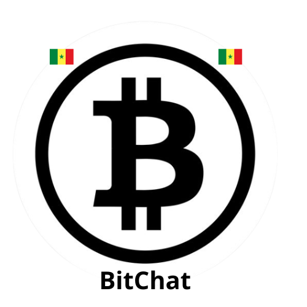

# Bitchat


## Description
Le projet consiste en la création d'une application éducative et communautaire sur le Bitcoin spécialement adaptée au marché sénégalais. L'objectif principal est de démocratiser la compréhension et l'utilisation du Bitcoin au Sénégal, de fournir des informations éducatives et de construire une communauté passionnée autour de cette technologie.

## Fonctionnalités Principales
Suivi des Prix en Temps Réel : Affichez les prix du Bitcoin en temps réel et des graphiques interactifs pour suivre les tendances du marché.

Chatbot d'Assistance : Intégration de l'API GPT-3 d'OpenAI pour répondre aux questions des utilisateurs sur le Bitcoin et fournir des informations éducatives.

Conversion de Devises : Permet aux utilisateurs de convertir facilement entre le Bitcoin et le franc CFA, la monnaie sénégalaise.

Cours en Ligne : Offrez des cours en ligne sur le Bitcoin et les cryptomonnaies, avec la possibilité de délivrer des certificats de participation.

Forums et Discussions : Créez des forums de discussion pour les utilisateurs pour poser des questions, partager leurs expériences et discuter de l'actualité Bitcoin au Sénégal.

Langue Locale : Proposez du contenu en wolof, en plus du français, pour toucher un public plus large.

Programme de Récompenses et de Parrainage : Récompensez les utilisateurs pour parrainer de nouveaux membres.

# logo 


Le projet consiste en la création d'une application éducative et communautaire sur le Bitcoin spécifiquement adaptée au marché sénégalais. L'objectif est d'attirer les Sénégalais vers l'application en proposant des fonctionnalités éducatives, informatives et interactives liées au Bitcoin, tout en favorisant la création d'une communauté passionnée.

## Technologies Utilisées

- [Flutter](https://flutter.dev) : Un framework open source pour le développement d'applications multiplateformes. Nous utilisons Flutter pour créer une interface utilisateur attrayante et réactive, qui fonctionnera sur différentes plateformes, notamment Android, iOS et le web.

- [Firebase](https://firebase.google.com) : Une plateforme de développement d'applications mobiles et web de Google. Firebase est utilisé pour la gestion des utilisateurs, l'authentification, le stockage de données, les notifications push et l'hébergement de l'application.

- [OpenAI API](https://beta.openai.com) : L'API de chat GPT-3 d'OpenAI est utilisée pour alimenter le chatbot d'assistance, fournir des réponses informatives aux questions des utilisateurs et créer un contenu éducatif sur le Bitcoin.

  ## Getting Started

To get started with BitChat mobile a, follow these instructions:

### Installation

Clone this repository to your local machine:

```
git clone https://github.com/Cheikhcoder/BitChat
cd BitcoinHackaton/my_app
```

Install dependencies:
```
flutter pub get
```
Run the app:
```
flutter run
```


